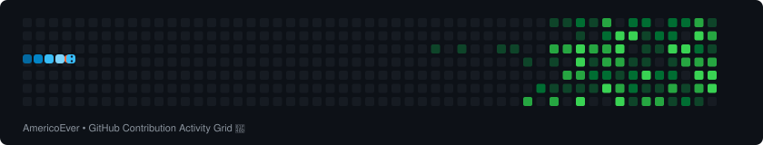

  

  <a href="https://github.com/AmericoEver"> Moçambique</a> | 
  <a href="https://github.com/AmericoEver"> Português</a>

  <h1>
    
  </h1>

  
  
  

  👋 Olá! Sou um <strong>Engenheiro de Software & Desenvolvedor Full Stack</strong> apaixonado por criar arquiteturas robustas, interfaces modernas e experiências digitais intuitivas. Aqui você encontrará meus projetos, experimentos práticos e soluções de ponta a ponta. 

- 🔭 Atualmente desenvolvendo aplicações web escaláveis, sistemas de gestão e plataformas LMS (EdTech).
- 🌱 Constantemente aprimorando conhecimentos em arquitetura limpa (MVC), segurança da informação e performance web.
- 💬 Vamos conversar sobre desenvolvimento de software, arquitetura de sistemas e novas tecnologias!

---

## 🛠️ Tecnologias e Ferramentas

  

---

## 📊 Estatísticas do GitHub

  
  &nbsp;
  

 

  
  
<em>💡 Dica: Para sincronizar os commits de repositórios privados da organização nas estatísticas, ative "Include private contributions" em Contribution Settings.</em>

 

  
   
  
<em>🐍 Minha dedicação à alimentação da cobra do GitHub!</em>

---

  <h2>⚡ Frase Aleatória</h2>
  

---

## 📬 Conecte-se Comigo

  
  &nbsp;&nbsp;
  
  &nbsp;&nbsp;
  

 

  

