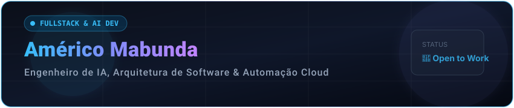

  

  <a href="https://github.com/AmericoEver"> Moçambique</a> | 
  <a href="https://github.com/AmericoEver"> Português</a>

  
  
  

 

  👋 Olá! Sou <strong>Engenheiro Informático</strong> com sólida experiência no ciclo completo de desenvolvimento de sistemas (Fullstack) e automação de infraestruturas críticas. Especialista em resolver problemas complexos de negócios através de <strong>IA Generativa, Python, Node.js e PHP (Laravel)</strong>.

- 🤖 **Engenharia de IA & Automação**: Integração de IA no ciclo de desenvolvimento, agentes autônomos e automação de processos corporativos.
- 🏢 **Sistemas Corporativos**: Arquitetura e desenvolvimento de ecossistemas ERP, Microsserviços e Plataformas LMS.
- 🔒 **Infraestrutura & Cibersegurança**: Servidores Linux, Docker, Governança de TI (ITIL/Scrum) e Redes certificadas Huawei.
- 🎓 **Formação**: Licenciado em Engenharia Informática | Huawei ICT Academy Certified.

---

## 🛠️ Tecnologias & Stack de Engenharia

  

---

## 📊 Estatísticas Oficiais & Atividade GitHub

  

 

  <picture>
    <source media="(prefers-color-scheme: dark)" srcset="https://raw.githubusercontent.com/AmericoEver/AmericoEver/output/snake-dark.svg">
    <source media="(prefers-color-scheme: light)" srcset="https://raw.githubusercontent.com/AmericoEver/AmericoEver/output/snake.svg">
    
  </picture>
   
  
<em>🐍 Jogo da cobrinha oficial devorando as 1.223+ contribuições em tempo real!</em>

---

  <h3>⚡ Frase Dev</h3>
  <blockquote>
    <em>“Beauty is more important in computing than anywhere else in technology because software is so complicated. Beauty is the ultimate defense against complexity.”</em> 
    <strong>— David Gelernter</strong>
  </blockquote>

---

### 📫 Conecte-se Comigo

  
  
  

